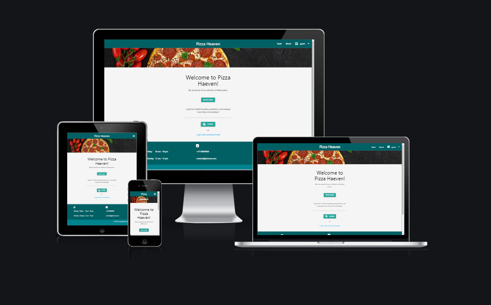
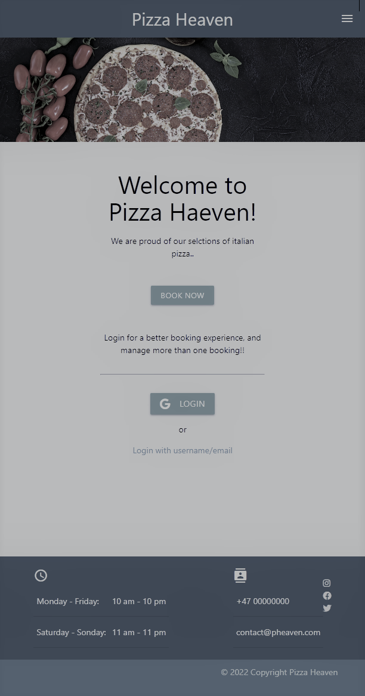
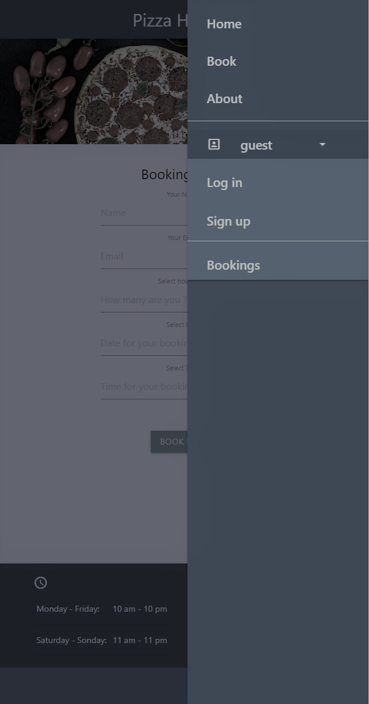

<h1 align="center">Pizza Heaven - Resturant Booking</h1>

[View the live project here.](https://resturant-booking-p4.herokuapp.com/)

This is the official page for Pizza Heaven. It is designed to be responsive and accessible on a range of devices, making it easy to navigate.
The site offers a booking system on a fictive resturant, where the user can make a reservation and manage the booking by updating, or cancelling
directly from the website. If the user is authenticated / logged in, it's possible make more than one booking vs. if the user is not logged in,
it's limited to one booking only. Email's are sent to the email provided in the booking as well, when 1) creating a new booking 2) updating, or
3) cancelling. In addition to this, the user have a Bookings page where he/she can manage all the bookings.

<h2 align="center">
    
</h2>

## User Experience (UX)
-   ### User stories


    The user stories can be found [here](https://github.com/users/nno24/projects/2/views/1)

-   ### Design
    -   #### Colour Scheme
        -   The three main colours used are cyan darken-4, white, and black. The css uses the materializecss css library.
    -   #### Typography
        -   Uses the materializecss standard fonts.
    -   #### Imagery
        -   Theres one image, background image for all pages, this is an illustrative image of an italian pizza.

        #### Media
        -  There are no particular media elements.

        #### Social Media
        -  The footer has all social media links with icons making it easy for the user to click
        and follow. There is no added links to these, because this is a fictive site. But the icons are taken 
        from fontawesome cdn. See base.html.
    <h2 id="wireframes"></h2>
-   ### Wireframes/Mockup
-   <h2 align="center">
    
    
</h2>


## Features

-   Fully interactive booking form including data input validation. 
    It's also including check of date/time. So it's not possible to book for a time in the past

-   The booking form have date and time pickers for easy use/UX design from the materializecss library.

-   The user will be informed by visual messages and landing pages if the booking was successful or not.
    This is also true if modifying or cancelling the booking.
    The user will also get an email for the booking, the email entered in the booking form. This is true for
    1) new bookings 2) modifyed a booking 3) cancelled a booking.

-   Role based authentication including login with google account. If the user is not authenticated, it's only possible to make one single booking.
    If the user is authenticated, it's possible to make unlimited bookings.
-   Superuser can login via the website, and manage all bookings and user accounts, when logged on. It's an extra available menu option "manage".
-   A Bookings page displaying all the users current bookings. From this page, it's possible to manage all bookings.
    The page can be accessed via the dropdown menu in the main menu.

-   The about and menu/booking sites is just fictive and illustrative for demonstration purposes only.

-   The navbar is responsive, and uses side-nav functionality from materializecss during resizing to mobile/tablet devices.
-   Error handling for all possible scenarios, if something goes wrong, the user is redirected to a dedicated error/landing page.
-   Backend routines: The webpage will clear up all expired bookings, when one day old. Meaning if the booking data have expired, not the date the booking was created.

## Features to be added/fixed
-   Add more possible ways to login
-   More information on the page, e.g a menu.

## Technologies Used

### Languages Used

-   [HTML5](https://en.wikipedia.org/wiki/HTML5)
-   [CSS3](https://en.wikipedia.org/wiki/Cascading_Style_Sheets)
-   [JavaScript](https://www.javascript.com/about)
-   [jQuery](https://jquery.com/)
-   [Python](https://www.python.org/)

### Frameworks, Libraries & Programs Used
1. [django](https://www.djangoproject.com/)
    - Django is a high-level Python fullstack web framework that was used for implementing the MVC.
1. [heroku:](https://dashboard.heroku.com/)
    - Used for production, hosting service for the app with the postgresql
1. [Cloudinary:](https://cloudinary.com/)
    - Cloudinary was used to host the static files, like custom css, javascript and images.
1. [Materializecss:](https://materializecss.com/)
    - Materializecss was used for css and date/time pickers.
1. [Fontawesome:](https://fontawesome.com/)
    - Fontawesome was used for icons in the socials section in the footer
1. [Google QAuth](https://console.cloud.google.com/)
    - Used for enabling Google login
1. [Django-allauth](https://pypi.org/project/django-allauth/)
    - Used for authentication login/signup handling in django.
      Base template in allauth is modified to fit the site look and feel.
11. [Git](https://git-scm.com/)
    - Git was used for version control by utilizing the Gitpod terminal to commit to Git and Push to GitHub.
1. [GitHub:](https://github.com/)
    - GitHub is used to store the projects code after being pushed from Git.
1. [GitPod:](https://gitpod.io/)
    - GitPod is used as the IDE for the project.
1. [Chrome-DevTools:](https://developer.chrome.com/docs/devtools/)
    - Chrome DevTools was used to test responsiveness on all devices,to inspect html/css, and to debug the application.
1.  [Am I Responsive?](http://ami.responsivedesign.is/)
    - Am I Responsive? was used to create the screenshot of the website for all devices, the first image of the README.
1.  [Nu Html Checker](https://validator.w3.org/nu/)
    - Used for validating html
1.  [Webpagetest](https://www.webpagetest.org/)
    - Used for performance and security testing.
1.  [Jigsaw CSS validator](https://jigsaw.w3.org/css-validator/)
    - Used for validating CSS.
1. [Jsvalidate](https://codebeautify.org/jsvalidate)
    - Used for validating javascript
1. [pep8online](http://pep8online.com/)
    - USed for validating python


## Testing

1. [Nu Html Checker](assets/testing/test-html-checker.PNG)
1. [Jigsaw CSS Checker](assets/testing/test-css-validator.PNG)
1. [JavaScript Checker](assets/testing/test-js.PNG)
1. [pep8online Checker views.py](assets/testing/pep8.PNG)
1. [Webpagetest performance](assets/testing/webpagetest-performance.PNG)
2. [Webpagetest requests](assets/testing/webpagetest-request-details.PNG)
1.  Manual testing have been conducted on mobile and desktop. Every possible scenario is tested, and
    exception handling is implemented thereafter. The code is well written in terms of exceptions.


## Deployment

### Heroku

The project was deployed to Heroku using the following steps...

1. Signup to heroku
2. Created the appname
3. Added environment variables and heroku postgresql
4. Attached the git repo to heroku, under deploy tab.
5. Deployed from heroku web interface

### Forking the GitHub Repository

By forking the GitHub Repository we make a copy of the original repository on our GitHub account to view and/or make changes without affecting the original repository by using the following steps...

1. Log in to GitHub and locate the [GitHub Repository](https://github.com/nno24/fullstack-toolkit-p4)
2. At the top of the Repository (not top of page) just above the "Settings" Button on the menu, locate the "Fork" Button.
3. You should now have a copy of the original repository in your GitHub account.

### Making a Local Clone

1. Log in to GitHub and locate the [GitHub Repository](https://github.com/nno24/fullstack-toolkit-p4)
2. Under the repository name, click "Clone or download".
3. To clone the repository using HTTPS, under "Clone with HTTPS", copy the link.
4. Open Git Bash
5. Change the current working directory to the location where you want the cloned directory to be made.
6. Type `git clone`, and then paste the URL you copied in Step 3.

```
$ git clone https://github.com/nno24/fullstack-toolkit-p4
```

7. Press Enter. Your local clone will be created.

```
$ git clone https://github.com/nno24/fullstack-toolkit-p4
> Cloning into `CI-Clone`...
> remote: Counting objects: 10, done.
> remote: Compressing objects: 100% (8/8), done.
> remove: Total 10 (delta 1), reused 10 (delta 1)
> Unpacking objects: 100% (10/10), done.
```

Click [Here](https://help.github.com/en/github/creating-cloning-and-archiving-repositories/cloning-a-repository#cloning-a-repository-to-github-desktop) to retrieve pictures for some of the buttons and more detailed explanations of the above process.

## Credits
1. Django documentation
2. Stackoverflow at times.

### Code

-   The pizza background image came from [Motionarray](https://motionarray.com/) with the right licence to use.


### Content

-   All content was written by the developer.

### Media

- N/A

### Acknowledgements

-   My Mentor [Precious Ijege](https://www.linkedin.com/in/precious-ijege-908a00168/?originalSubdomain=ng) for continuous helpful feedback.

-   Tutor support at Code Institute for their support.
